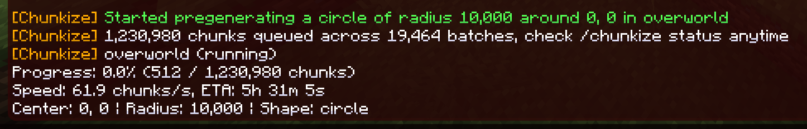
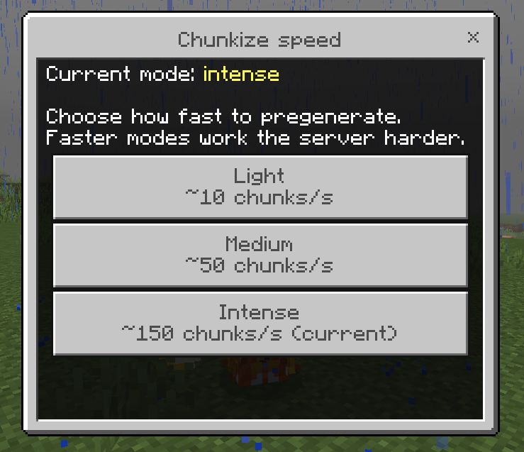

<div align="center">
  
</div>

Chunk pregeneration for [Endstone](https://github.com/EndstoneMC/endstone) Bedrock servers, made by **ozz**.

Generate your world ahead of time so players never hit chunk generation lag. Works like [Chunky](https://modrinth.com/plugin/chunky) does for Java edition, but built for Bedrock Dedicated Server.

## How it works

Bedrock Dedicated Server has no API to load or generate chunks directly. Chunkize works around that by driving the vanilla `/tickingarea` command. The target region is split into chunk-aligned batches, and each batch gets a temporary ticking area which forces the server to generate those chunks. Chunkize listens for chunk load events to know when a batch has loaded, then holds the area for a settle period so generation can fully finish, and stamps every chunk with a touch-and-restore block write so the server is guaranteed to save it to disk. Only then is the ticking area removed and the next batch started, spiraling outward from the center until the whole region is generated.

Progress is saved to disk, so a server restart or crash picks up right where it left off.

## Installation

1. Download the latest `.whl` from the releases page.
2. Drop it into the `plugins` folder of your Endstone server.
3. Restart the server.

Or build it yourself:

```bash
pip install build
python -m build
```

The wheel lands in `dist/`.

## Commands

| Command | Description |
| --- | --- |
| `/chunkize start <radius> [dimension] [centerX] [centerZ] [shape]` | Start pregenerating. Radius is in blocks. Run as a player and it defaults to your position and dimension, from console it defaults to overworld around 0, 0. Shape is `square` (default) or `circle`. |
| `/chunkize pause` | Pause the current task. |
| `/chunkize resume` | Resume a paused task, even after a restart. |
| `/chunkize cancel` | Cancel the task and wipe saved progress. |
| `/chunkize status` | Show progress, speed and ETA. |
| `/chunkize config` | Open the speed mode picker (in game), or `/chunkize config <light\|medium\|intense>` from the console. |

Examples:

```
/chunkize start 5000
/chunkize start 3000 nether
/chunkize start 10000 overworld 0 0 circle
```



## Speed modes

`/chunkize config` opens a pop up to choose how hard Chunkize works the server. The choice is saved and used for every future generation. **Medium** is the default until you pick one.



| Mode | Rate | Use it when |
| --- | --- | --- |
| Light | ~10 chunks/s | The server has players on and you want generation barely noticeable. |
| Medium | ~50 chunks/s | Balanced, the default. |
| Intense | ~150 chunks/s | Empty server or strong hardware, generate as fast as the server allows. |

Rates are approximate and depend on your hardware. Each mode sets the underlying generation settings below; you can still override any individual key in `config.toml` for fine control.

## Configuration

`plugins/chunkize/config.toml` is created on first run. The speed keys are set by the chosen mode, listing them here only for advanced overrides.

| Key | Default | Description |
| --- | --- | --- |
| `cellChunks` | `10` | Side length of each batch in chunks. Maximum 10, since a ticking area caps out at 100 chunks. |
| `minActiveAreas` | `1` | Fewest ticking areas to keep running, even when the server is busy. The generator never throttles below this. |
| `maxActiveAreas` | `8` | Most ticking areas to run at once. Chunkize ramps up toward this while the server has headroom and backs off when it doesn't. Bedrock allows 10 per world, leave headroom if your server uses its own. |
| `targetMspt` | `45` | Server load target in milliseconds per tick. The generator adds ticking areas while the server stays under this and sheds them when it goes over. 50 ms is the 20 TPS budget, so a lower value keeps more headroom for players. |
| `checkIntervalTicks` | `5` | How often the generator checks progress and rotates batches. |
| `cellTimeoutSeconds` | `60` | How long to wait on a batch before retrying it, then skipping it. |
| `verifyGeneration` | `true` | Release a batch as soon as its chunks have really generated (checked per chunk) instead of waiting a fixed time. Faster on batches that finish quickly, and it keeps waiting on any that haven't, so no patchy or missing chunks. The end dimension can't be verified and falls back to the timer. |
| `settleMinSeconds` | `1` | Shortest a batch is held after its chunks load, even once verified. |
| `settleSeconds` | `8` | Longest a batch is held waiting for generation to finish (the safety cap, and the fixed wait when verifyGeneration is off). Raise it if you still see patchy spots. |
| `stampChunks` | `true` | Touch one block per chunk (written and instantly restored) to mark the chunk dirty, forcing the server to persist it. |
| `maxRadius` | `50000` | Safety cap for the radius argument. |
| `flushIntervalChunks` | `512` | Flush the world save to disk after this many generated chunks, so unsaved chunks cannot pile up in memory. 0 disables the cycle. |
| `autoResume` | `true` | Continue an interrupted task automatically after a restart. |
| `logIntervalSeconds` | `30` | Progress log interval in the console, 0 to disable. |
| `saveIntervalSeconds` | `30` | How often progress is written to disk. |

## Permissions

| Permission | Default | Description |
| --- | --- | --- |
| `chunkize.command` | op | Access to `/chunkize`. |

## Good to know

- Generation speed self-tunes to the server. Chunkize watches milliseconds per tick and runs more ticking areas in parallel while there is headroom, then backs off as load rises, so it goes fast on an idle server and gets out of the way when players are on. Raise `maxActiveAreas` for more top speed on strong hardware, or lower `targetMspt` to keep it gentler.
- Generated chunks stay in RAM until the server saves them. Chunkize flushes the save on a cycle so the backlog stays bounded, if you still see memory pressure lower `flushIntervalChunks` or `maxActiveAreas`.
- The flush uses the vanilla `save hold` / `save resume` cycle. If you run a backup tool that uses the same commands, schedule backups outside generation runs.
- The world keeps its ticking area budget while Chunkize runs. If your server already uses several ticking areas, lower `maxActiveAreas` so the total stays under 10.
- Already generated regions are processed much faster than fresh terrain, since loading is cheaper than generating.
- Nether radius is in nether blocks. A 1000 block nether radius covers the same map area as 8000 overworld blocks.

## License

MIT, see [LICENSE](LICENSE).
